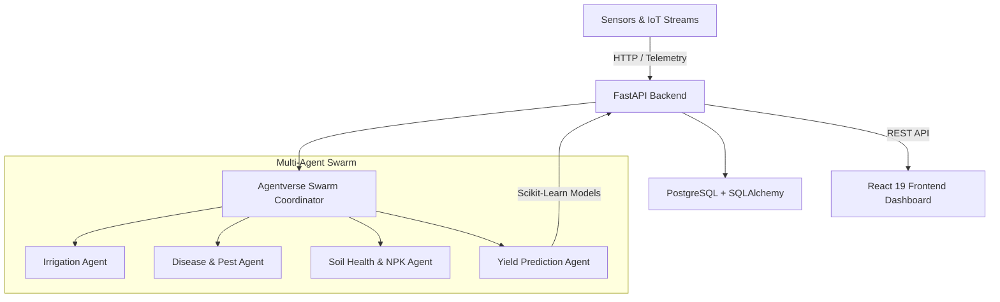

# Cardamom Care - System Architecture

## Overview

Cardamom Care is a multi-agent AI system designed for precision cardamom farming. It integrates IoT sensor streams, soil health analytics, automated pest/disease diagnosis, and predictive yield models.

## Core Components

1. **Frontend (`apps/frontend`)**: Built with React 19, TypeScript, Vite, Tailwind CSS, and shadcn/ui. Provides real-time dashboard visualizations with Recharts.
2. **Backend (`apps/backend`)**: Built with Python FastAPI, SQLAlchemy, Alembic, and PostgreSQL. Handles API routing, database sessions, and background AI tasks.
3. **AI Swarm (`Agentverse`)**: Multi-agent coordination layer executing autonomous agents for irrigation triggers, disease detection, and yield prediction via Scikit-learn models.
4. **Shared Workspace (`packages/shared`)**: Common TypeScript types, constants, and data contract definitions.
